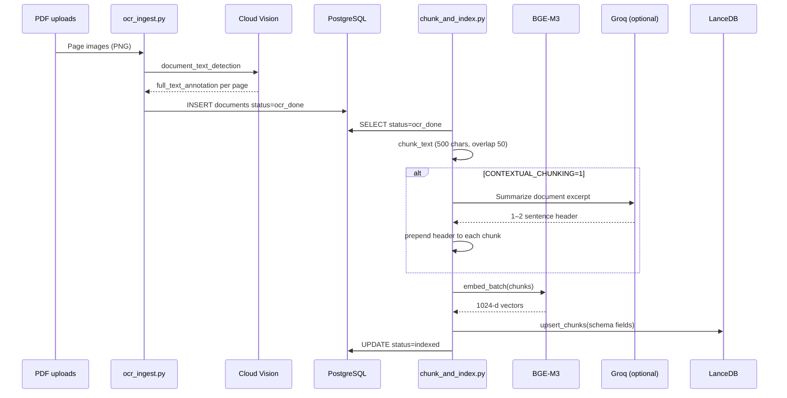
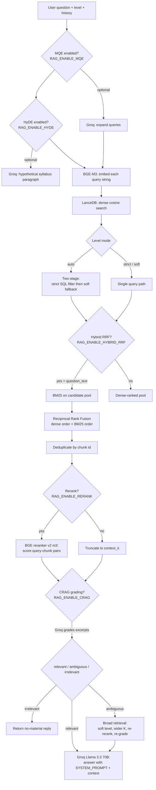

# DanceGPT — System Architecture & Model Stack

This document describes the **end-to-end architecture** of DanceGPT (Bharatanatyam Gandharva exam tutor), the **exact deep learning / ML models** referenced in code, retrieval and generation pipelines, configurable behavior, and **design trade-offs**. It is derived from the current repository implementation (FastAPI AI service, Node API, LanceDB, Postgres, ingestion scripts).

---

## 1. Purpose and high-level design

DanceGPT is a **retrieval-augmented generation (RAG)** application:

1. **Ingestion**: syllabus PDFs are rasterized to images, text is extracted with **Google Cloud Vision**, chunked, optionally enriched with an LLM-written document header, embedded with **BAAI/bge-m3**, and stored in **LanceDB** with metadata (`level`, `topic`, etc.).
2. **Inference**: user questions are embedded with the same bi-encoder; **cosine nearest-neighbor search** retrieves candidates; optional **BM25 + reciprocal rank fusion (RRF)** merges lexical and dense rankings; a **cross-encoder reranker** refines ordering; optional **CRAG-style** relevance grading may trigger a broader second retrieval; finally **Llama 3.3 70B Versatile** on **Groq** generates the answer conditioned on retrieved chunks.

The stack separates concerns:

| Layer | Technology | Role |
|--------|------------|------|
| Web UI | Next.js (`frontend/`) | Chat, flashcards, notes UX |
| Backend API | Express (`api/`) | Auth, sessions, Postgres persistence, proxy to AI |
| AI service | FastAPI (`ai/`) | Embeddings, LanceDB queries, reranking, Groq calls |
| Vector DB | LanceDB (`data/lancedb`, configurable) | Chunk storage + vector search |
| Relational DB | PostgreSQL | Users, chat, documents pipeline state |

---

## 2. System architecture (component view)

```mermaid
flowchart TB
    subgraph Client["Client"]
        FE[Next.js frontend<br/>localhost:3000]
    end

    subgraph API["Node API (Express)"]
        EX[api/index.js<br/>PORT 3001]
        AUTH[/auth/*]
        CHAT[/chat/*]
        FC[/flashcards/*]
        EX --> AUTH
        EX --> CHAT
        EX --> FC
    end

    subgraph Data["Data stores"]
        PG[(PostgreSQL<br/>Docker :5433→5432)]
        LDB[(LanceDB<br/>chunks table)]
    end

    subgraph AI["Python AI service (FastAPI)"]
        FAST[main.py / uvicorn :8000]
        RAG[rag.py — RAG orchestration]
        EMB[embeddings.py — BGE-M3]
        RR[rerank.py — cross-encoder]
        LNC[lancedb_client.py]
        FAST --> RAG
        RAG --> EMB
        RAG --> RR
        RAG --> LNC
    end

    subgraph External["External ML APIs"]
        GROQ[Groq OpenAI-compatible API<br/>Llama 3.3 70B Versatile]
        GCV[Google Cloud Vision<br/>document_text_detection]
    end

    FE <-->|REST + cookies| EX
    CHAT -->|fetch AI_SERVICE_URL| FAST
    FC -->|generate-cards| FAST
    EX <-->|DATABASE_URL| PG
    LNC <-->|LANCEDB_PATH| LDB
    RAG <-->|HTTPS| GROQ
    OCR[scripts/ocr_ingest.py] -->|GCP| GCV
    OCR --> PG
    IDX[scripts/chunk_and_index.py] --> PG
    IDX --> LDB
    IDX --> EMB
```

---

## 3. Exact models and services (authoritative identifiers)

These are the **exact strings / APIs** used in this codebase.

### 3.1 Bi-encoder embeddings (dense retrieval)

| Field | Value |
|--------|--------|
| **Model ID** | `BAAI/bge-m3` |
| **Library** | `sentence_transformers.SentenceTransformer` |
| **Implementation file** | `ai/embeddings.py` |
| **Output** | L2-normalized dense vectors used as LanceDB embedding column |
| **Vector dimension** | **1024** (fixed in `ai/lancedb_client.py` as `VECTOR_DIM = 1024` for the LanceDB schema) |
| **Similarity** | Cosine distance in LanceDB (`distance_type("cosine")`) |

The indexing script explicitly loads this model for batch encoding (`scripts/chunk_and_index.py`).

### 3.2 Cross-encoder reranker

| Field | Value |
|--------|--------|
| **Default model ID** | `BAAI/bge-reranker-v2-m3` |
| **Override** | Environment variable `RAG_RERANKER_MODEL` |
| **Library** | `sentence_transformers.CrossEncoder` |
| **Implementation file** | `ai/rerank.py` |
| **I/O** | Pairs `(query, chunk_text)` → scalar relevance scores; candidates sorted descending |

### 3.3 Large language model (generation & auxiliary NLP)

| Field | Value |
|--------|--------|
| **Chat / RAG answer model** | `llama-3.3-70b-versatile` (constant `GROQ_MODEL` in `ai/rag.py`) |
| **Provider** | Groq — OpenAI-compatible HTTP API (`base_url`: `https://api.groq.com/openai/v1`) |
| **Client** | `openai.OpenAI` with Groq base URL + `GROQ_API_KEY` |
| **Uses** | Final tutoring reply; optional multi-query expansion (MQE); HyDE hypothetical passage; CRAG relevance grading; JSON flashcard generation; optional document summarization for contextual chunking |

**Index-time contextual enrichment** (`ai/contextual.py`): defaults to the same Groq model string via `_DEFAULT_MODEL = "llama-3.3-70b-versatile"`, overridable with **`GROQ_MODEL`** environment variable (note: `rag.py` does not read `GROQ_MODEL` for chat—it uses the hardcoded constant).

### 3.4 OCR (document understanding ingress)

| Field | Value |
|--------|--------|
| **Service** | **Google Cloud Vision API** |
| **RPC used** | `document_text_detection` per page image (`scripts/ocr_ingest.py`) |
| **Client** | `google.cloud.vision.ImageAnnotatorClient` |
| **Preprocessing** | PDF pages → PNG bytes (PyMuPDF rasterization preferred; pypdf/Pillow fallback for embedded images) |

This is a **managed cloud OCR pipeline**, not a locally shipped neural checkpoint in this repo.

---

## 4. Data ingestion pipeline



### 4.1 Chunking parameters (implemented)

- **Chunk size**: 500 characters  
- **Overlap**: 50 characters  
- **Strategy**: sliding windows over concatenated OCR page text (`\n\n` joined), not token-aware segmentation  

### 4.2 LanceDB row schema (`ai/lancedb_client.py`)

| Column | Type (PyArrow) | Role |
|--------|----------------|------|
| `id` | UTF-8 | Chunk UUID |
| `doc_id` | UTF-8 | Links to Postgres `documents.id` |
| `page_num` | int32 | Coarse page attribution (implementation uses min page set from OCR JSON when assigning per chunk) |
| `text` | UTF-8 | Chunk text (possibly prefixed by contextual header) |
| `vector` | `list[float32]` length **1024** | BGE-M3 embedding |
| `level` | UTF-8 | Exam level filter facet |
| `topic` | UTF-8 | Topic metadata |

---

## 5. Query-time RAG pipeline (chat)

Entry point: **`POST /ai/chat`** (`ai/routers/chat.py`) → `rag.query_rag()`.

End-user path: **Frontend → `POST /chat/message` (Express)** → **`POST {AI_SERVICE_URL}/ai/chat`** with `question`, `level` from user profile, and **rolling history** (Express loads up to 10 prior turns; FastAPI applies **only the last 6** messages in `query_rag`).



### 5.1 Implemented retrieval scoring details

**Soft level rescoring** (`lancedb_client.py`): After dense retrieval in soft mode, cosine distance is multiplied by `(1 + penalty * level_distance)` where `level_distance` is discrete steps between user level and chunk level on ladder `Preliminary → Junior → Intermediate → Senior` (`General` treated as neutral).

**BM25** (on the retrieved candidate pool only): Classic BM25 with **`k1 = 1.5`**, **`b = 0.75`**, tokenization `[^\W_]+` lowercase Unicode words.

**RRF**: For each ranking list, chunk id receives score contribution `1 / (k + rank + 1)` with default **`RAG_RRF_K = 60`**; fused ids sorted by summed score.

### 5.2 Key environment toggles (defaults from code)

| Variable | Default | Meaning |
|----------|---------|---------|
| `RAG_RETRIEVE_K` | `24` | Max chunks pulled per retrieval query before rerank/truncate |
| `RAG_CONTEXT_K` | `5` | Chunks kept after reranking for grading / prompt context |
| `RAG_LEVEL_MODE` | `auto` | `auto` → strict then soft if too few rows; `strict` / `soft` fixed |
| `RAG_LEVEL_PENALTY` | `0.15` | Soft-mode distance multiplier step per exam-level mismatch |
| `RAG_TWO_STAGE_MIN_ROWS` | `3` | Minimum rows before auto mode escalates to soft fallback |
| `RAG_ENABLE_HYBRID_RRF` | `1` | Fuse dense + BM25 ranks |
| `RAG_RRF_K` | `60` | RRF smoothing constant |
| `RAG_ENABLE_RERANK` | `1` | Cross-encoder reranking |
| `RAG_ENABLE_CRAG` | `1` | LLM relevance gate + ambiguous broadening |
| `RAG_ENABLE_MQE` | `0` | Multi-query expansion via Groq |
| `RAG_MQE_VARIANTS` | `3` | Extra queries if MQE on |
| `RAG_ENABLE_HYDE` | `0` | HyDE hypothetical doc string added as retrieval query |
| `RAG_ENABLE_CARD_SANITY` | `1` | Enable flashcard relevance + grounding checks |
| `RAG_CARD_MIN_GROUNDED` | `3` | Minimum supported cards required after grounding filter |
| `CONTEXTUAL_CHUNKING` | `0` | Prepend Groq doc summary to every chunk at index time |

Generation hyperparameters in code: **MQE** temperature `0.3`; **HyDE** `0.4`; **CRAG grade** `0.0`; **flashcards** `0.2` with optional `response_format=json_object`; **final chat answer** temperature **`0.7`**.

---

## 6. Study / flashcards path

**`POST /ai/study/generate-cards`** (`ai/routers/study.py`): Reuses **`retrieve_syllabus_context`** — same LanceDB + hybrid + rerank stack as chat retrieval (with `top_n=10`), then **`llama-3.3-70b-versatile`** emits **JSON** `{ "cards": [ {"front","back"}, ... ] }` constrained by a strict system prompt (`STUDY_CARDS_SYSTEM` in `rag.py`).

Before returning cards, the flashcard path now includes two sanity checks:
- **Pre-generation relevance gate**: rejects weak/off-topic retrieval context.
- **Post-generation grounding check**: verifies each card against retrieved excerpts and drops unsupported cards; optionally enforces a minimum grounded-card count.

Template decks are seeded per-topic for both **Junior** and **Senior** levels (`scripts/generate_syllabus_decks.py`), so the frontend can offer pre-made syllabus-topic decks instead of only one deck per level. The Express routes proxy via `api/routes/flashcards.js`.

---

## 7. Trade-offs and design rationale

### 7.1 `BAAI/bge-m3` (bi-encoder)

**Strengths**

- Strong **semantic retrieval** for paraphrased exam questions vs syllabus wording.  
- **Normalized embeddings + cosine** match standard practice for nearest-neighbor search.  
- Single forward pass per query → **lower latency** than cross-attention over all documents.

**Trade-offs**

- **Bi-encoder limitation**: Query and document vectors are computed independently; subtle token-level interactions can be missed vs a cross-encoder or generative retrieval.  
- **Fixed dimension (1024)** and schema coupling: switching embedding models requires **reindexing** and LanceDB schema alignment.  
- **Memory / disk**: First-time Hugging Face download can be large (the indexing script warns ~2 GB class payloads depending on caching).  
- **Character chunking**: 500-char windows may split terminology across chunks unless overlap catches it—trade simplicity vs linguistic boundaries.

### 7.2 `BAAI/bge-reranker-v2-m3` (cross-encoder)

**Strengths**

- **More accurate relevance** than bi-encoder cosine alone, especially for fine-grained mismatches (“right topic, wrong sub-answer”).  
- Same model family (`bge-*-m3`) as embeddings often **calibrates well** jointly in multilingual / general text settings.

**Trade-offs**

- **Compute scales with candidates**: Scoring `N` pairs is heavier than one query embedding—`RAG_RETRIEVE_K` directly affects rerank cost.  
- Typically **GPU-advantaged**; CPU inference can be a latency bottleneck under load.  
- **No new recall**: Reranking only reorders what dense+RRF already retrieved; if the true passage is outside the pool, reranking cannot surface it.

### 7.3 Hybrid BM25 + RRF alongside dense search

**Strengths**

- BM25 excels at **exact rare terms**, transliterations, and **short keyword-style** syllabus tokens that dense models might diffuse.  
- RRF is **simple, non-learned fusion**—robust without training a separate fusion model.

**Trade-offs**

- BM25 runs on the **candidate pool only**, not the full corpus—if dense search misses a chunk entirely, BM25 never sees it.  
- RRF introduces **hyperparameter sensitivity** (`RAG_RRF_K`); poorly tuned fusion can overweight one signal.  
- Extra CPU work for tokenization + scoring on each query path when enabled.

### 7.4 `llama-3.3-70b-versatile` on Groq (LLM)

**Strengths**

- **High-capacity instruction following** for tutoring tone, synthesis, JSON flashcards, and lightweight “judge” labels in CRAG.  
- Groq provides **low-latency hosted inference** compared to many self-hosted 70B setups.

**Trade-offs**

- **External dependency**: Availability, quotas, and pricing are tied to Groq; **no local weight access** for research reproducibility unless mirrored elsewhere.  
- **Retrieval-grounding is not guaranteed**: Even with prompts, models can **overgenerate**—mitigated here by syllabus context injection and CRAG-style refusal / second pass, but not eliminated.  
- **Temperature mismatch risk**: Chat generation uses **`temperature=0.7`** (more creative/varied) while grading uses **`0.0`**—good for determinism on the judge, but higher temperature on answers increases variance in exam-focused settings.  
- **MQE / HyDE**: Each adds **extra LLM calls** → cost and latency; HyDE text may **drift from true syllabus** and mislead retrieval if ungrounded.

### 7.5 CRAG-style relevance grading

**Strengths**

- Reduces confident **hallucinations** when retrieved text is off-topic (`irrelevant` → fixed string reply).  
- **Ambiguity handling** triggers broader retrieval instead of immediate failure.

**Trade-offs**

- Adds **at least one LLM call** per query when CRAG is on (plus possible second grading after broad retrieval).  
- **Classifier brittleness**: Single-word labels parsed from natural language can be noisy; misclassification either blocks valid answers or allows bad ones.

### 7.6 Google Cloud Vision OCR

**Strengths**

- Strong baseline **printed text** OCR on rasterized pages; reduces custom CV pipeline burden.

**Trade-offs**

- **Cloud privacy / compliance**: Exam materials leave the deployment perimeter unless Vision is contractually acceptable.  
- **Cost per page** vs batch local OCR models.  
- **Artistic layouts / degraded scans / handwritten annotations** remain failure modes common to generic OCR.

### 7.7 LanceDB + Postgres split

**Strengths**

- LanceDB keeps **vector workload local** and simple (`pip install lancedb`).  
- Postgres remains **source of truth** for auth, chat history, document workflow.

**Trade-offs**

- Two stores to **backup and migrate**.  
- Distributed deployment must ensure AI instances share consistent **`LANCEDB_PATH`** or replicated storage.

---

## 8. Operational checklist (research reproduction)

1. **PostgreSQL**: `docker-compose.yml` exposes **`5433:5432`** on the host—align `DATABASE_URL` accordingly.  
2. **Groq**: Set **`GROQ_API_KEY`** in `.env` (see `ai/.env.example`).  
3. **AI service**: Run FastAPI (`uvicorn main:app`) so **`AI_SERVICE_URL`** (default `http://localhost:8000`) matches Express.  
4. **Models**: First runs download **BGE-M3** and **BGE reranker** weights via Hugging Face / `sentence-transformers` cache.  
5. **Index**: Ensure `chunk_and_index.py` has processed documents to `indexed`; confirm `lancedb_client.py` **`VECTOR_DIM`** matches embedding outputs.  
6. **Vision (optional OCR path)**: Configure Google ADC or `GOOGLE_APPLICATION_CREDENTIALS` for `ocr_ingest.py`.

---

## 9. File map (core ML / RAG logic)

| Path | Responsibility |
|------|----------------|
| `ai/embeddings.py` | `SentenceTransformer("BAAI/bge-m3")` |
| `ai/rerank.py` | `CrossEncoder` default `BAAI/bge-reranker-v2-m3` |
| `ai/lancedb_client.py` | Schema, cosine search, soft level rescoring, BM25, RRF, two-stage level policy |
| `ai/rag.py` | MQE, HyDE, retrieval merge, rerank, CRAG, Groq chat + flashcards |
| `ai/contextual.py` | Optional Groq document summary for chunks |
| `scripts/chunk_and_index.py` | Chunk, embed, LanceDB upsert, status updates |
| `scripts/ocr_ingest.py` | PDF → Vision OCR → JSON + Postgres row |

---

*This README reflects the repository as implemented; if you change model IDs, schema dimensions, or prompts, update this document in parallel for your course submission.*
