# DanceGPT — Architecture Reference

This document is the canonical architecture reference for DanceGPT (Bharatanatyam Gandharva exam tutor). It includes the comparison table and flowcharts from the project diagrams, supplementary Mermaid figures for systems not drawn in those assets, and implementation-aligned notes from the current codebase.

---

## Table of contents

1. [Architecture evolution](#1-architecture-evolution)
2. [Baseline systems](#2-baseline-systems)
   - [Lewis et al. 2020 (RAG)](#21-lewis-et-al-2020-rag)
   - [Yan et al. 2024 (CRAG)](#22-yan-et-al-2024-crag)
   - [Chen et al. 2024 (BGE-M3 embedding)](#23-chen-et-al-2024-bge-m3-embedding)
3. [DanceGPT pipelines](#3-dancegpt-pipelines)
   - [Dataset ingestion](#31-dataset-ingestion)
   - [Inference (7 stages)](#32-inference-7-stages)
4. [Data model](#4-data-model)
5. [Pipeline stage coverage](#5-pipeline-stage-coverage)
6. [How DanceGPT perceives the dataset](#6-how-dancegpt-perceives-the-dataset)
7. [Dataset caveats](#7-dataset-caveats)
8. [Side-by-side differentiators](#8-side-by-side-differentiators)
9. [DanceGPT differentiators (mindmap)](#9-dancegpt-differentiators-mindmap)

---

## 1. Architecture evolution

RAG research progressed from **retrieve-then-generate** on open Wikipedia (Lewis 2020), through **corrective retrieval** with graded fallbacks (CRAG 2024), to **hybrid dense–lexical retrieval with cross-encoder reranking and LLM judges** on a closed domain corpus (DanceGPT).

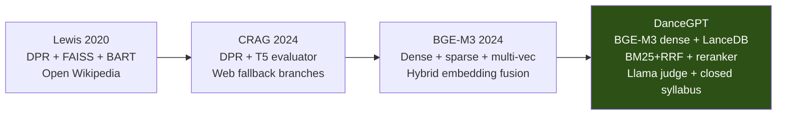

DanceGPT **adopts ideas** from each predecessor but **does not replicate** full stacks: it uses BGE-M3’s **dense head only**, CRAG’s **three-way judge** without web search, and Lewis-style **static corpus ANN** without joint BART training.

---

## 2. Baseline systems

### 2.1 Lewis et al. 2020 (RAG)

Original retrieval-augmented generation: offline passage indexing with DPR, MIPS search at query time, and a seq2seq generator conditioned on retrieved passages.

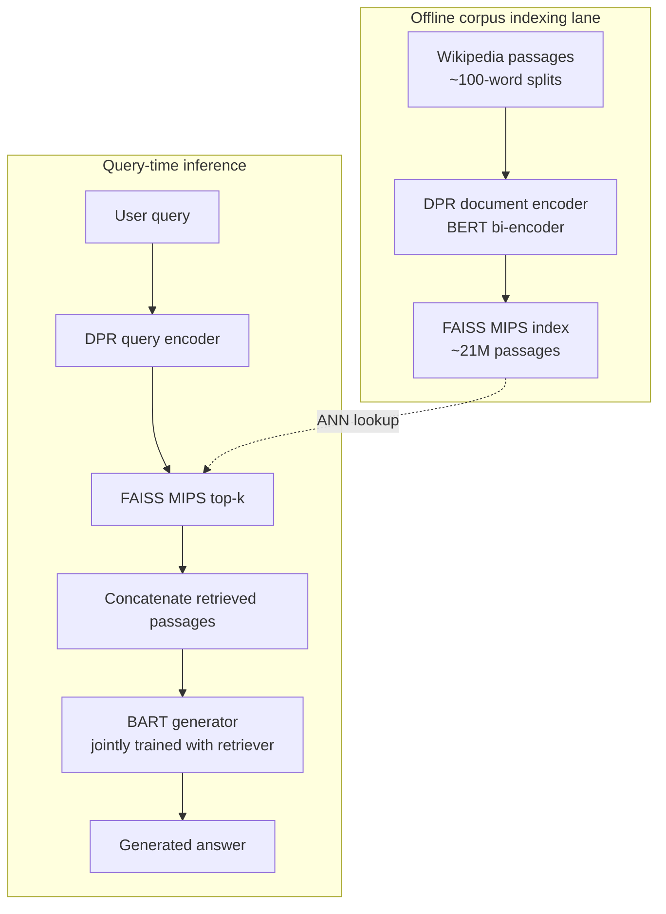

| Aspect | Lewis 2020 |
|--------|------------|
| Retriever | BERT DPR bi-encoder |
| Index | FAISS MIPS |
| Corpus | Open Wikipedia (~21M) |
| Generator | BART (end-to-end RAG training) |
| Grader / fallback | None |

---

### 2.2 Yan et al. 2024 (CRAG)

Corrective RAG adds a **retrieval evaluator** and three corrective actions before generation.

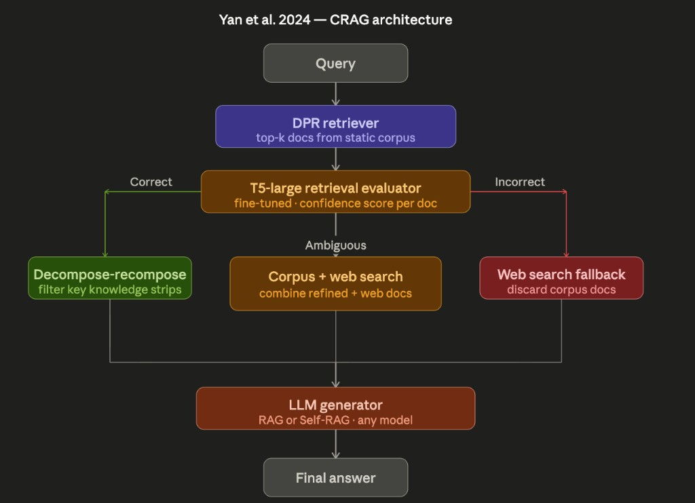

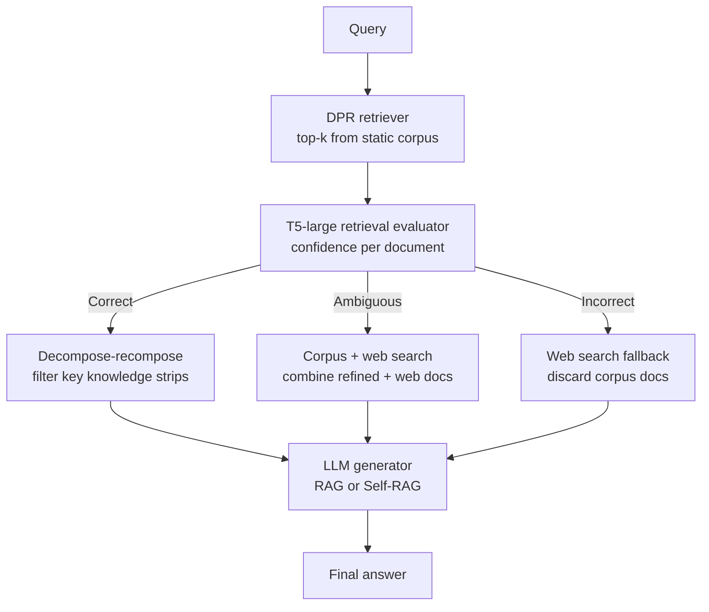

| Branch | Action |
|--------|--------|
| **Correct** | Decompose-recompose retrieved strips |
| **Ambiguous** | Corpus retrieval + web search |
| **Incorrect** | Discard corpus; web search only |

---

### 2.3 Chen et al. 2024 (BGE-M3 embedding)

BGE-M3 is a **unified embedding model** with three retrieval heads on a shared XLM-RoBERTa backbone. DanceGPT uses **only the dense head** in production.

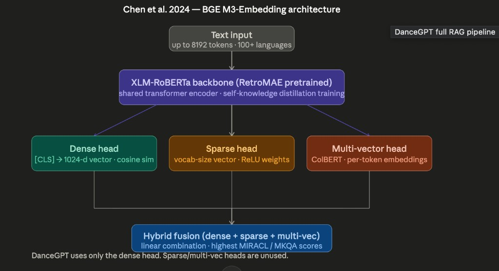

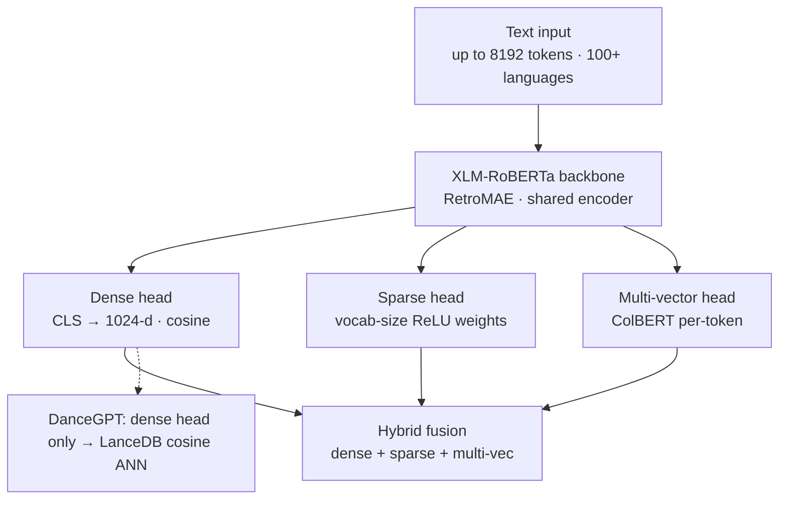

---

## 3. DanceGPT pipelines

### 3.1 Dataset ingestion

Syllabus PDFs become searchable chunks through an offline CLI pipeline. PostgreSQL tracks document workflow; LanceDB holds vectors.

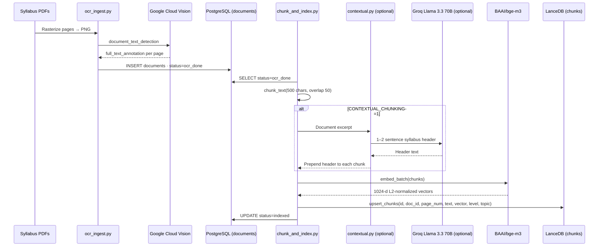

**Chunking (implemented):** 500 characters, 50 overlap, sliding windows over OCR text joined with `\n\n` — not token-aware.

**Scripts:** `scripts/ocr_ingest.py`, `scripts/chunk_and_index.py`, optional `scripts/batch_ingest.py`.

---

### 3.2 Inference (7 stages)

Full query-time pipeline for chat (`POST /ai/chat` → `rag.query_rag()`).

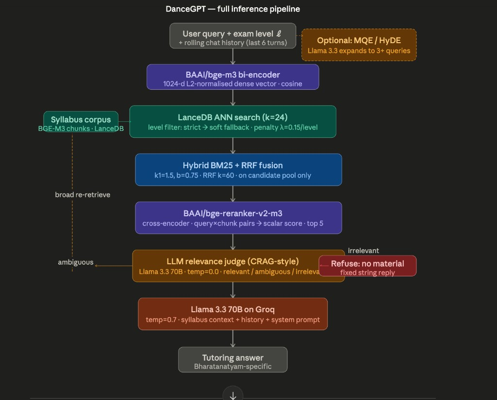

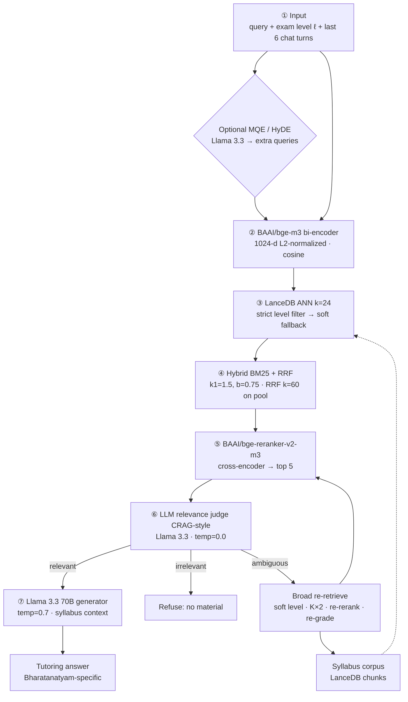

**Level penalty (soft mode):** After dense retrieval, cosine distance is rescaled:

\[
d' = d \times \bigl(1 + \lambda \cdot \mathrm{level\_distance}(\ell_{\mathrm{user}}, \ell_{\mathrm{chunk}})\bigr)
\]

- \(\lambda\) = `RAG_LEVEL_PENALTY` (default **0.15**)
- Ladder: `Preliminary → Junior → Intermediate → Senior`; `General` is neutral
- **Strict filter:** SQL `level = user_level OR level = 'General'`
- **Auto mode:** strict first; if fewer than `RAG_TWO_STAGE_MIN_ROWS` (3), **soft** fallback with penalty rescoring

**Ambiguous branch:** Re-embed original question only, `level_mode=soft`, `retrieve_k` up to `min(2×K, 48)`, rerank, second CRAG grade; still **no web search** (corpus-only corrective retrieval).

---

## 4. Data model

### 4.1 LanceDB schema (ER diagram)

LanceDB stores **chunks**; PostgreSQL stores **documents** and workflow state. Join key: `chunks.doc_id` → `documents.id`.

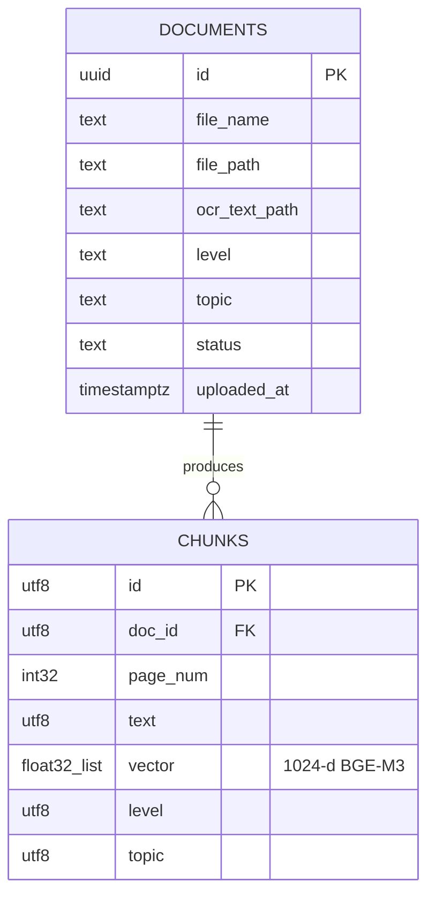

| `chunks` column | PyArrow type | Role |
|-----------------|--------------|------|
| `id` | UTF-8 | Chunk UUID |
| `doc_id` | UTF-8 | FK to Postgres `documents.id` |
| `page_num` | int32 | Coarse page attribution from OCR JSON |
| `text` | UTF-8 | Chunk body (optional contextual header prefix) |
| `vector` | `list<float32>` × 1024 | L2-normalized BGE-M3 dense embedding |
| `level` | UTF-8 | Exam level facet (`Preliminary` … `Senior`, `General`) |
| `topic` | UTF-8 | Topic metadata (e.g. Theory, Tala) |

**Storage path:** `data/lancedb/` (override with `LANCEDB_PATH`). Implementation: `ai/lancedb_client.py`.

### 4.2 Dataset ingestion flow (summary)

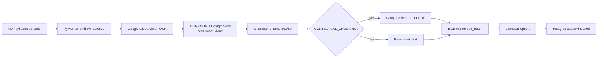

---

## 5. Pipeline stage coverage

Side-by-side count of **distinct inference-time stages** (offline indexing counted separately where it defines the system).

| System | Offline indexing | Query-time stages | Total (typical path) |
|--------|------------------|-------------------|----------------------|
| **Lewis 2020** | Passage split → DPR doc encode → FAISS build (**2**) | Query encode → MIPS retrieve → BART generate (**3**) | **5** |
| **CRAG 2024** | Static corpus + DPR index (**1**) | DPR retrieve → T5 evaluator → branch action → LLM generate (**4**) | **5** |
| **BGE-M3 2024** | Model pretrain (not app-specific) | Shared encode → 3 heads → hybrid fusion (**3** as retriever) | **3** (embedding stack) |
| **DanceGPT** | OCR → chunk → optional contextualize → embed → LanceDB (**4–5**) | Input → encode → ANN+level → BM25+RRF → rerank → LLM judge → generate (**7**) | **11–12** end-to-end |

**DanceGPT’s seven inference stages (numbered in diagram):**

| # | Stage | Component |
|---|--------|-----------|
| 1 | Input conditioning | Query + level ℓ + history (6 turns); optional MQE/HyDE |
| 2 | Dense encoding | `BAAI/bge-m3` |
| 3 | Vector retrieval | LanceDB cosine ANN, `k=24`, strict→soft level |
| 4 | Hybrid fusion | BM25 on candidate pool + RRF (`k=60`) |
| 5 | Reranking | `BAAI/bge-reranker-v2-m3` → top 5 |
| 6 | Relevance judge | Llama 3.3 70B, temp=0.0 (relevant / ambiguous / irrelevant) |
| 7 | Generation | Llama 3.3 70B on Groq, temp=0.7 |

---

## 6. How DanceGPT perceives the dataset

The system never “reads” PDFs at query time. It perceives the syllabus only through **embedded chunk records** in a 1024-dimensional cosine space, with metadata gates.

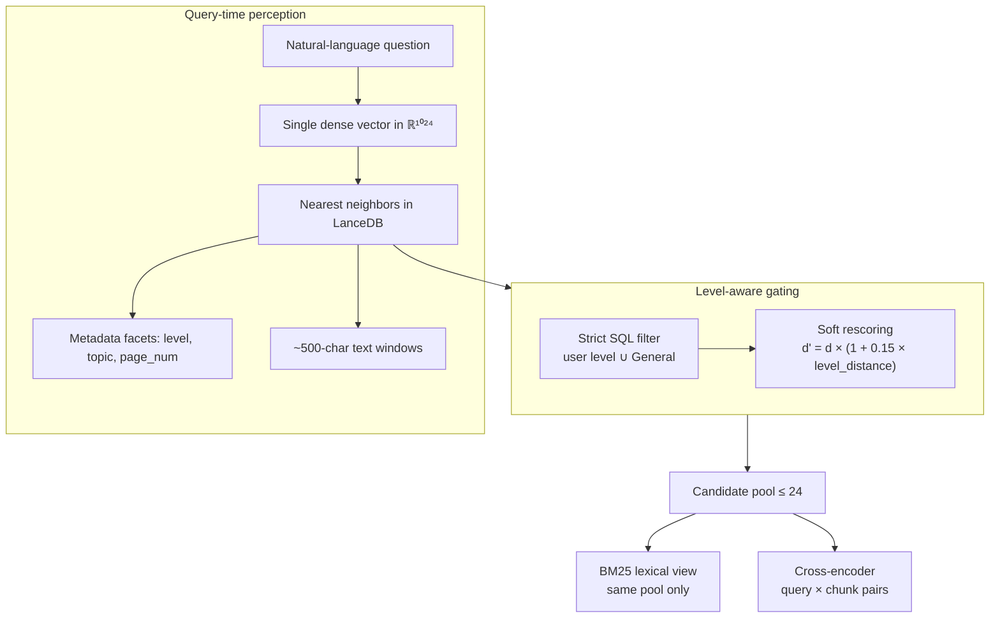

| Perception dimension | What the model “sees” | Implication |
|---------------------|------------------------|-------------|
| **Embedding space** | Semantic similarity of chunk text (dense BGE-M3 only) | Paraphrases match; rare spellings may need BM25+RRF |
| **Granularity** | Fixed ~500-character windows with 50-char overlap | Long explanations split; overlap partially heals boundaries |
| **Level** | User profile level vs chunk `level` + penalty ladder | Wrong metadata or distant level chunks rank lower or are filtered |
| **Topic** | Stored facet, not a hard filter in default RAG | Useful for ingestion organization; retrieval is primarily vector+lexical |
| **Provenance** | `doc_id`, `page_num` in rows | Citations are coarse; not sentence-level anchors |
| **Corpus boundary** | Only LanceDB rows from ingested PDFs | No knowledge outside indexed syllabus |

---

## 6.1 Flashcard generation and template decks

Flashcards use the same retrieval substrate as chat but add explicit safety checks before templates/decks are created.

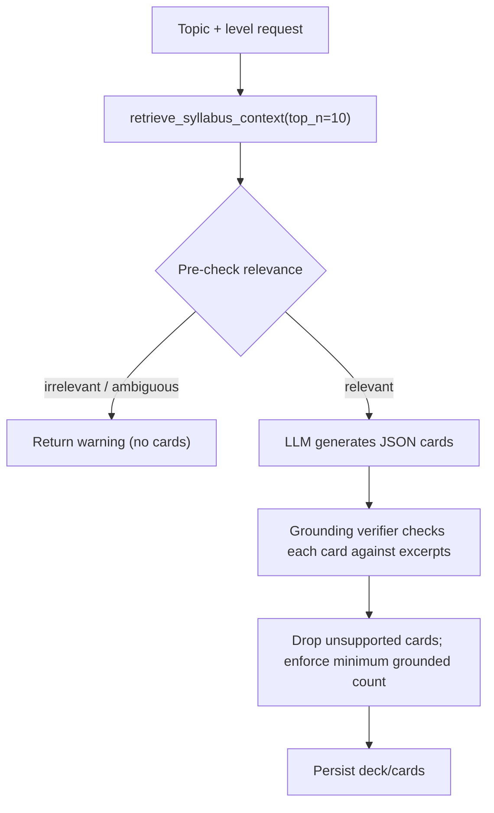

- **Sanity check env toggles**: `RAG_ENABLE_CARD_SANITY=1`, `RAG_CARD_MIN_GROUNDED=3`.
- **Template strategy**: `scripts/generate_syllabus_decks.py` now seeds **per-topic** templates for both **Junior** and **Senior** from the canonical taxonomy, rather than one deck per level.
- **Frontend effect**: pre-made templates are grouped by level and topic, with optional level filtering.

---

## 7. Dataset caveats

Eight known limitations of the current syllabus dataset and indexing design, and how they propagate to retrieval quality.

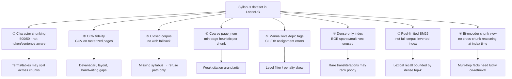

| # | Caveat | Mitigation in DanceGPT |
|---|--------|------------------------|
| 1 | Character windows | 50-char overlap; optional contextual header |
| 2 | OCR errors | Manual QA on ingest; re-run OCR on bad PDFs |
| 3 | Closed domain | CRAG judge returns fixed “no material” string |
| 4 | Page attribution | Accept coarse refs; improve ingest metadata later |
| 5 | Metadata quality | Consistent `level`/`topic` at `documents` insert |
| 6 | Dense-only | BM25+RRF on dense pool; cross-encoder rerank |
| 7 | BM25 scope | Raise `RAG_RETRIEVE_K`; ambiguous pass widens pool |
| 8 | Chunk independence | MQE/HyDE (optional); broader ambiguous retrieval |

---

## 8. Side-by-side differentiators

Comparison of Lewis 2020, CRAG 2024, BGE-M3 2024, and DanceGPT across the dimensions used in the project comparison table.

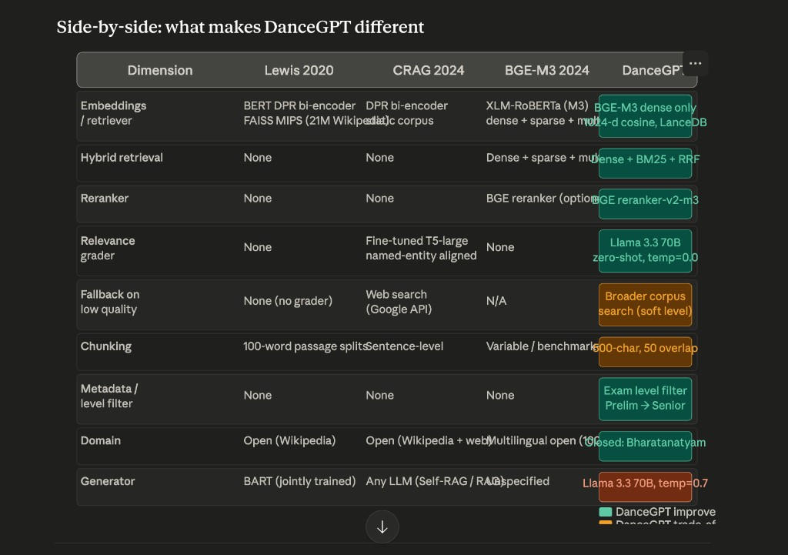

| Dimension | Lewis 2020 | CRAG 2024 | BGE-M3 2024 | DanceGPT |
|-----------|------------|-----------|-------------|----------|
| **Embeddings / retriever** | BERT DPR bi-encoder; FAISS MIPS; 21M Wikipedia | DPR bi-encoder; static corpus | XLM-RoBERTa M3: dense + sparse + multi-vec | **BGE-M3 dense only, 1024-d cosine, LanceDB** |
| **Hybrid retrieval** | None | None | Dense + sparse + multi-vec | **Dense + BM25 + RRF** |
| **Reranker** | None | None | BGE reranker (optional) | **BGE reranker-v2-m3** |
| **Relevance grader** | None | Fine-tuned T5-large, entity-aligned | None | **Llama 3.3 70B zero-shot, temp=0.0** |
| **Fallback on low quality** | None | Web search (Google API) | N/A | **Broader corpus search (soft level)** |
| **Chunking** | 100-word passage splits | Sentence-level | Variable / benchmark | **500-char, 50 overlap** |
| **Metadata / level filter** | None | None | None | **Exam level Prelim → Senior** |
| **Domain** | Open Wikipedia | Open Wikipedia + web | Multilingual open (100+) | **Closed: Bharatanatyam syllabus** |
| **Generator** | BART (jointly trained) | Any LLM | Not specified | **Llama 3.3 70B, temp=0.7** |

**Legend (DanceGPT column in diagram):** green = deliberate improvement; orange = trade-off; red/orange = generator choice (hosted LLM, non-zero temperature for answers).

---

## 9. DanceGPT differentiators (mindmap)

Everything novel relative to the three reference architectures, as implemented in this repository.

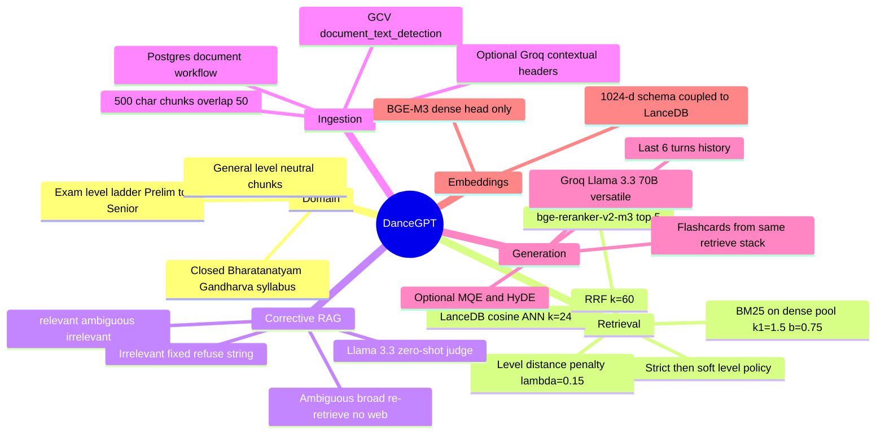

---

## Related documentation

| Document | Contents |
|----------|----------|
| [README.md](../README.md) | Model IDs, env toggles, trade-offs, file map |
| [SYSTEM_DESIGN.md](SYSTEM_DESIGN.md) | Product-level system design and Postgres API |
| `ai/rag.py`, `ai/lancedb_client.py` | Authoritative inference and retrieval code |

---

*Diagram assets live under `docs/architecture/diagrams/`. Update this file when model IDs, schema, or pipeline stages change.*
